# Diagram-Rich System Analysis and Design
## Building a Passwordless Authentication System for Web and Mobile Applications Based on an Identity Provider Model

## 1. Purpose of This Version
This version complements the main analysis by emphasizing architecture and workflow visualization. It is intended for thesis chapters, seminar presentations, and design-defense sessions where visual traceability between requirements, components, and security controls is required.

## 2. System Context and High-Level Architecture
### 2.1 Context Diagram
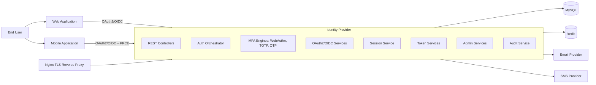

### 2.2 Layered Logical Architecture
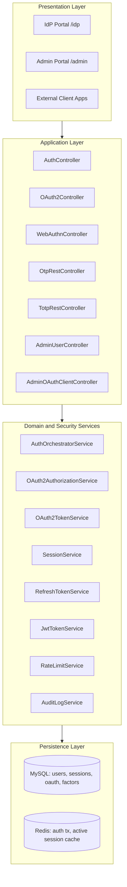

### 2.3 Trust Boundary Diagram
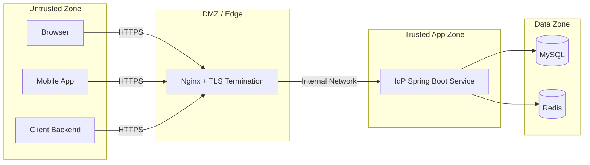

## 3. Authentication Design Diagrams
### 3.1 User Registration and TOTP Enrollment
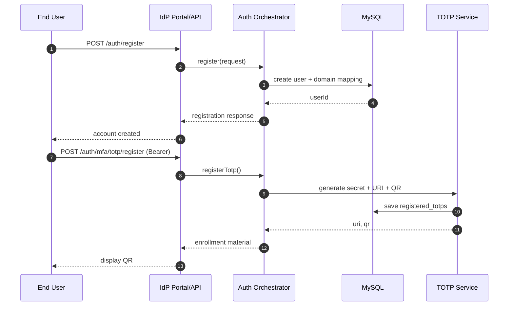

### 3.2 Login via WebAuthn (Passkey-First)
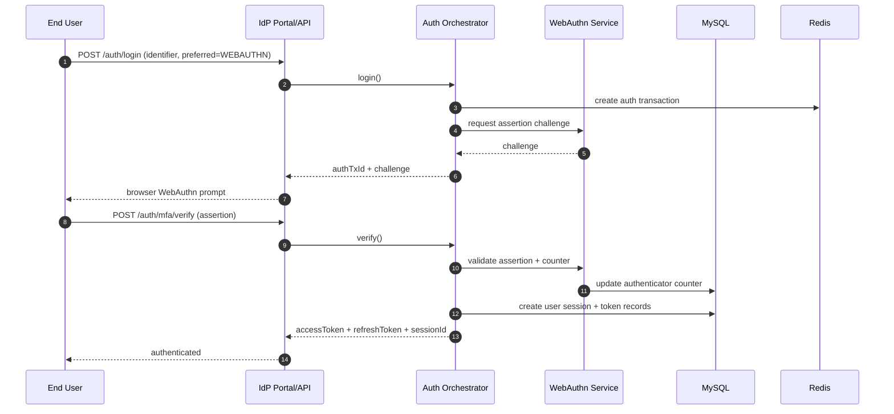

### 3.3 Login via OTP or TOTP
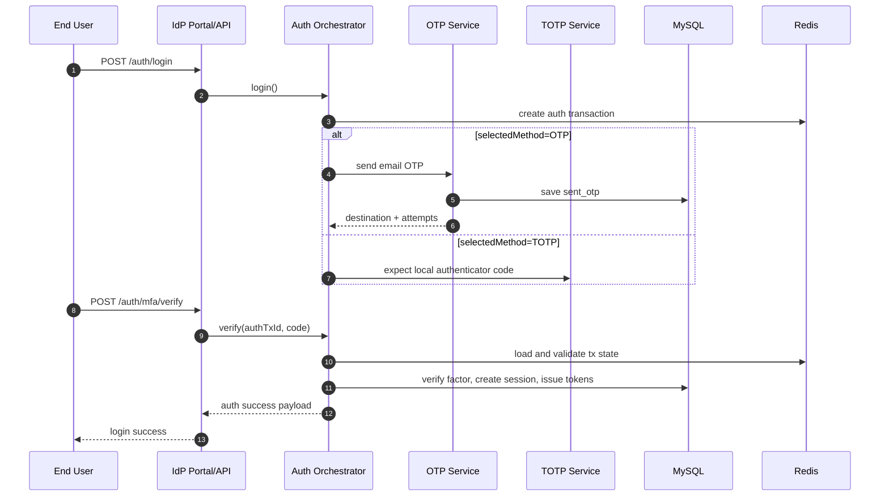

## 4. OAuth2 and OIDC Design Diagrams
### 4.1 Authorization Code Flow with PKCE
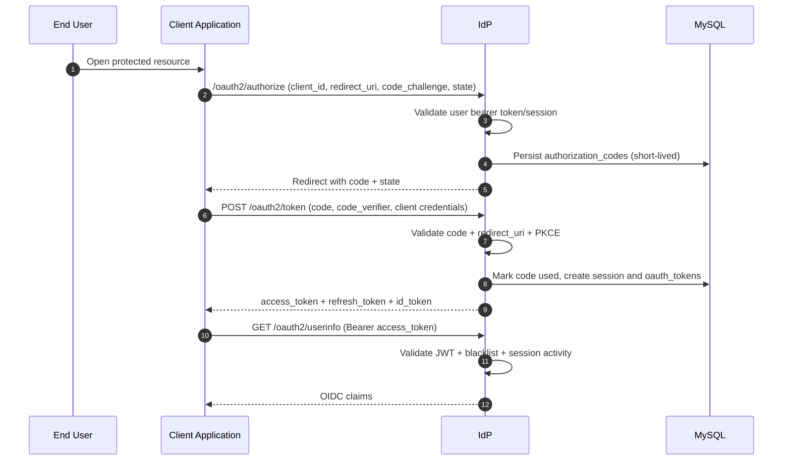

### 4.2 Refresh and Revocation Flow
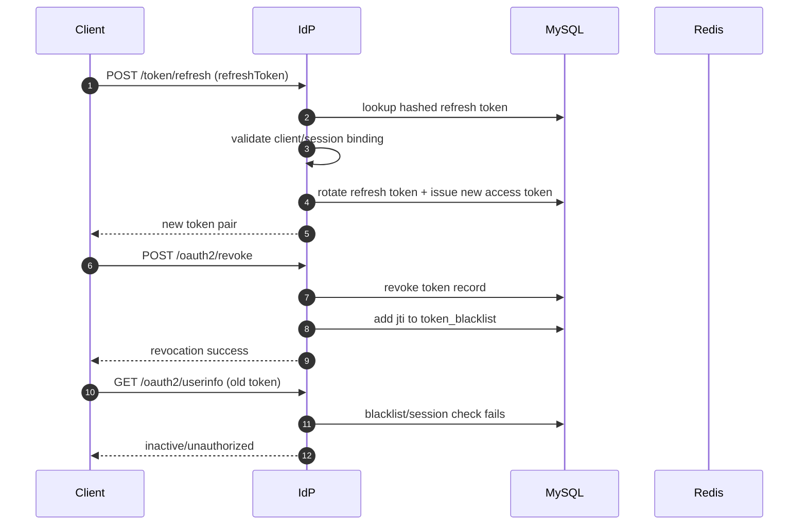

## 5. Data Model Diagram
### 5.1 Core ER Diagram
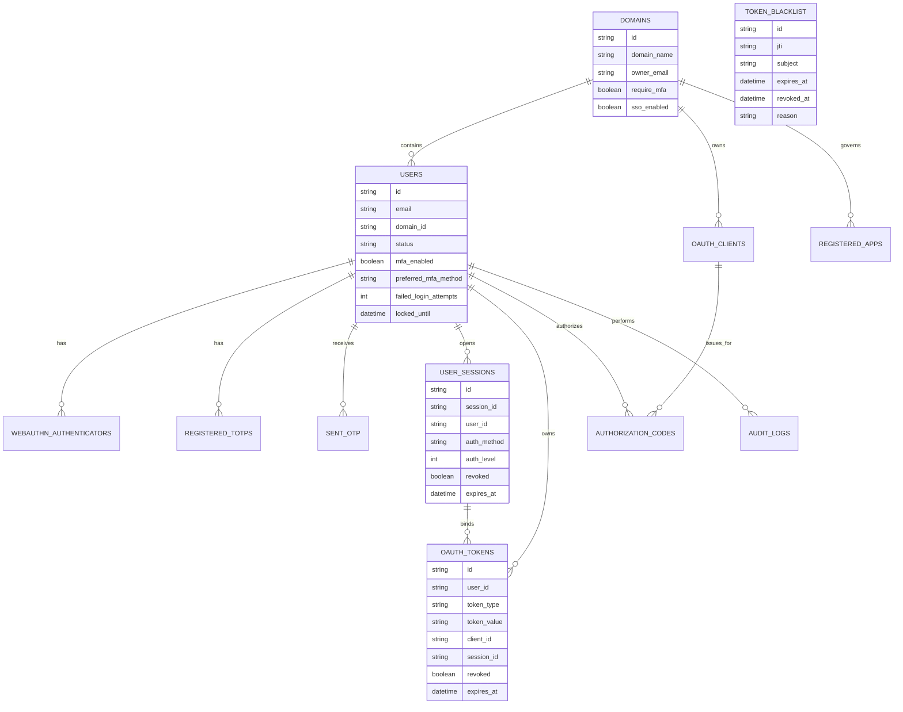

## 6. Security Control Mapping Diagram
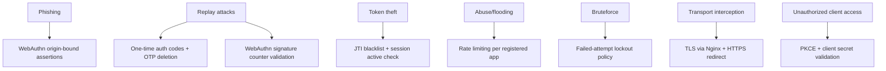

## 7. Deployment Diagram
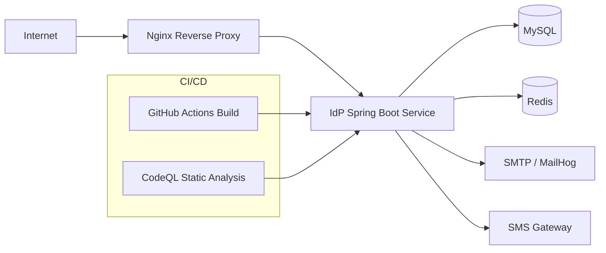

## 8. Design Interpretation and Architecture Decisions
### 8.1 Why Centralized IdP
- Reduces duplicated authentication logic in client applications.
- Provides uniform policy enforcement and auditability.
- Simplifies standards-based federation through OAuth2/OIDC.

### 8.2 Why Multi-Method Passwordless
- WebAuthn offers highest resistance to phishing and replay.
- TOTP offers robust offline fallback.
- OTP offers universal compatibility for account bootstrap and recovery.

### 8.3 Why Session and Token Dual Control
- Session table enables governance and device-level revocation.
- Token records and blacklist enable immediate cryptographic invalidation paths.

## 9. Recommended Enhancements (Diagram-Driven)
### 9.1 Authorization Boundary Hardening
- Add strict RBAC around all admin and app-governance endpoints.
- Introduce policy-engine decisions at controller/service entry.

### 9.2 Cryptographic Key Lifecycle
- Replace local deterministic signing key derivation with KMS/HSM-backed key management.
- Add key rotation timeline and multi-key JWKS rollover.

### 9.3 High-Availability WebAuthn Session Strategy
- Move challenge/session state to distributed session store or enforce sticky sessions.
- Add explicit multi-node challenge validation tests.

### 9.4 Secret Protection
- Encrypt TOTP secrets at application level using envelope encryption.
- Add key-id metadata for transparent re-encryption migration.

## 10. Suggested Thesis Usage
- Use this file for architecture and sequence figures.
- Use the strict thesis version for narrative chapters and formal structure.
- Use the Vietnamese version for localized academic submission.
