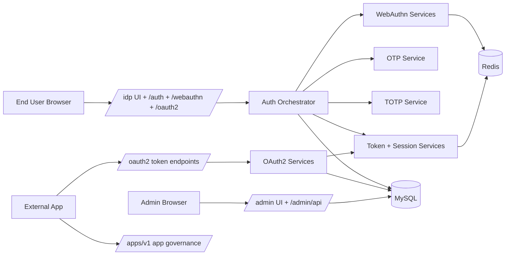
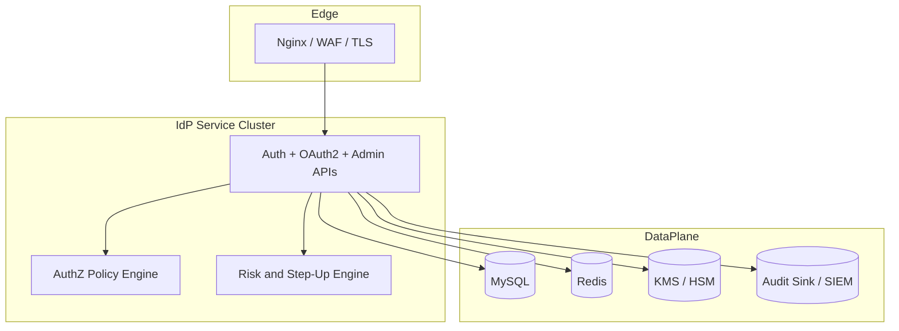

# IdP Analysis and Design
## Extended Technical Review and Redesign Notes (April 2026)

## Abstract
This document presents an implementation-grounded analysis and design review of the Passwordless Identity Provider (IdP) system in this repository. The system is a centralized authentication and authorization platform built on Spring Boot, providing passwordless login and delegated authorization for web and mobile clients. It combines WebAuthn/FIDO2, TOTP, OTP, OAuth2 Authorization Code + PKCE, and OpenID Connect discovery/userinfo capabilities.

Compared with the previous edition of this document, this version adds:
- a complete endpoint surface and module mapping based on source code,
- newly implemented FIDO2 USB security key begin/finish ceremonies,
- data lifecycle and state model details for MySQL + Redis,
- explicit trust boundaries and security risk analysis,
- operational architecture review (Docker, Nginx TLS, CI),
- implementation constraints and staged improvement roadmap.

## 1. Context and Objectives

### 1.1 Problem Context
Modern application ecosystems need stronger identity controls than password-only systems can provide. Password reuse, phishing, credential stuffing, and account recovery overhead all degrade security and user experience. In parallel, applications increasingly require federated sign-in and token-based delegated access across web and mobile channels.

This project addresses these pressures by centralizing identity responsibilities into one IdP service:
- authenticate users using passwordless methods,
- issue and govern OAuth2/OIDC tokens,
- provide consistent user/session/client administration,
- expose APIs and portals for both end users and operators.

### 1.2 Core Objectives
1. Deliver passwordless authentication with multiple methods (WebAuthn, TOTP, OTP).
2. Support standards-aligned delegated authorization (OAuth2 + PKCE, OIDC-compatible metadata).
3. Centralize session, token, and client governance.
4. Maintain practical deployability with containerized runtime and clear ops pathways.
5. Provide a foundation for production hardening and future research experimentation.

### 1.3 Scope
In scope:
- IdP backend architecture and module interaction.
- End-user portal and admin portal behavior.
- Data model and state transitions.
- Security mechanisms and known gaps.
- Deployment, CI, and test posture.

Out of scope:
- Native mobile SDK implementation details.
- External enterprise federation adapters (SAML / external IdP brokering).
- Full production-grade compliance controls (SOC2, ISO27001 controls mapping).

## 2. Evidence Base and Review Method

This document is based on a direct review of:
- source modules under `src/main/java/org/openidentityplatform/passwordless/**`,
- frontends under `src/main/resources/static/idp` and `src/main/resources/static/admin`,
- runtime configs (`application.yml`, `docker-compose.yaml`, `nginx/nginx.conf`, `Dockerfile`),
- database changelog (`src/main/resources/db/changelog/db.changelog-master.xml`),
- pipeline definitions (`.github/workflows/build.yml`, `.github/workflows/codeql-analysis.yml`),
- test assets and local test execution outcomes.

All design claims below are aligned to implemented behavior as of April 2026.

## 3. System Overview

### 3.1 Product Role
The system acts as a centralized Identity Provider with two operating modes:

1) End-user IdP mode (browser-centric):
- user registration and login,
- MFA enrollment and preference activation,
- OAuth2 authorization and token lifecycle,
- session inspection and revocation.

2) App-governance mode (API-key protected channel):
- app registration and API key lifecycle,
- OTP/TOTP API access governance,
- per-app rate limiting,
- audit event tracking.

### 3.2 Primary Actors
1. End User: registers and authenticates with passwordless factors; manages sessions.
2. Administrator: manages users, passkeys/TOTP keys, sessions, OAuth clients, and dashboards.
3. Relying Application: performs OAuth2 flow, exchanges tokens, introspects/revokes tokens.
4. Platform Operator: deploys and monitors the stack.

### 3.3 Feature Surface (As Implemented)
- Passwordless auth methods: OTP, TOTP, WebAuthn.
- OAuth2 endpoints: authorize, token, introspect, revoke.
- OIDC-compatible endpoints: userinfo, openid configuration, JWKS.
- Token refresh endpoint.
- Session lifecycle APIs (single revoke / revoke all).
- Admin APIs for user and OAuth-client governance.
- App registration APIs with API-key + rate limiting + audit logs.

## 4. Architecture Analysis

### 4.1 Layered Structure
The codebase is a modular monolith with clear package-level boundaries:

- Presentation Layer
  - End-user portal (`/idp`, static JS app)
  - Admin portal (`/admin`, static JS app)
  - REST controllers across auth, oauth2, webauthn, otp, totp, apps, admin

- Application/Service Layer
  - `AuthOrchestratorService` drives login and verification workflow
  - OAuth2 services for authorization, token exchange, introspection, revocation
  - WebAuthn registration/login services + ceremony state service
  - OTP/TOTP services for generation, delivery, and verification
  - App registration, rate limit, and audit services

- Persistence Layer
  - JPA repositories for durable identity/authorization records (MySQL)
  - Redis state for short-lived and active-session checks

### 4.2 Component View (Logical)

### 4.3 Runtime/Deployment Topology
Containerized runtime (default docker-compose):
- `nginx` for TLS termination and reverse proxy.
- `passwordless-service` (Spring Boot app).
- `mysql` persistent relational store.
- `redis` in-memory + AOF store for state/cache.
- `mailhog` for development email workflows.

Nginx is configured with Docker DNS runtime resolution (`resolver 127.0.0.11`) and forwards `X-Forwarded-*` headers. App uses `SERVER_FORWARD_HEADERS_STRATEGY=framework` to keep correct issuer/origin behavior behind proxy.

### 4.4 Security Filter Topology
`ApiKeyAuthenticationFilter` is enabled conditionally and applies API-key auth only to:
- `/otp/v1/**`
- `/totp/v1/**`

WebAuthn browser flows are intentionally excluded from API-key requirements.

Important observation: the global Spring Security config currently uses broad `permitAll` rules for many endpoint groups, including admin and auth APIs. This is a major hardening topic discussed in Section 10.

## 5. Module and API Inventory

### 5.1 Core End-User Identity APIs
Base: `/auth`
- `POST /register`
- `POST /login`
- `POST /mfa/verify`
- `POST /mfa/totp/register`
- `POST /mfa/totp/activate`
- `POST /mfa/webauthn/activate`
- `POST /mfa/email/activate`
- `GET /me`
- `POST /logout`
- `GET /sessions`
- `POST /sessions/{sessionId}/revoke`
- `POST /sessions/revoke-all`

### 5.2 WebAuthn APIs
Base: `/webauthn/v1`

Legacy compatibility endpoints:
- `GET /register/challenge/{username}`
- `POST /register/credential`
- `GET /login/challenge/{username}`
- `GET /login/challenge/`
- `POST /login/credential`

Production-style ceremony endpoints (new USB-key capable flow):
- `POST /register/begin`
- `POST /register/finish`
- `POST /login/begin`
- `POST /login/finish`

### 5.3 OAuth2/OIDC APIs
Base: `/oauth2`
- `GET /authorize` (redirect-based)
- `POST /authorize` (JSON variant)
- `POST /token`
- `POST /introspect`
- `POST /revoke`
- `GET /userinfo`
- `GET /.well-known/openid-configuration`
- `GET /jwks`

Additional well-known endpoints:
- `GET /.well-known/openid-configuration`
- `GET /.well-known/jwks.json`

### 5.4 OTP/TOTP APIs
- `/otp/v1`: register, send, verify
- `/totp/v1`: register, verify

### 5.5 App Governance and Audit APIs
- `/apps/v1`: register/list/get/activate/deactivate/delete/regenerate-key
- `/apps/v1/audit`: logs and stats retrieval

### 5.6 Admin APIs
- `/admin/api/users/**` for user lifecycle, factor inspection, session revocation
- `/admin/api/oauth2/clients/**` for OAuth client management
- `/admin/api/dashboard/stats`

## 6. Authentication and Authorization Design

### 6.1 Unified Authentication Transaction Pattern
Authentication starts with `/auth/login`, creating an auth transaction with TTL.
Transaction tracks:
- identifier,
- selected method,
- expiry,
- attempt count,
- IP/User-Agent,
- WebAuthn challenge (new explicit storage).

Flow pattern:
1. Initialize transaction.
2. Generate method-specific challenge.
3. Verify proof at `/auth/mfa/verify`.
4. On success: create session + issue tokens.
5. On failure: increment attempts and apply lockout policy.

### 6.2 Method Selection Strategy
`AuthOrchestratorService` selects method using enrollment state:
1. WebAuthn if passkeys exist.
2. TOTP if registered.
3. OTP if email available.

User can request a preferred method; validation ensures required enrollment exists.

### 6.3 OTP Design Notes
- Configurable per-sender OTP settings (length, charset, TTL, template).
- Resend throttling (`resendAllowedAfterMinutes`).
- Verification by destination or legacy session-id.
- Attempt counter decrements on failure.
- Successful verify deletes OTP record to prevent replay.

Observed implementation behavior:
- JIT provisioning is performed in OTP service to ensure user/domain rows exist for dashboard visibility when needed.

### 6.4 TOTP Design Notes
- Secret generated and encoded (Base32).
- Enrollment URI generated (`otpauth://...`) and QR rendered by QR service.
- Verification uses current TOTP timestep.

Observed behavior:
- Similar JIT provisioning pattern creates default-domain users if missing.

### 6.5 WebAuthn and USB Security Key Design

#### 6.5.1 Registration (Begin/Finish)
1. `/webauthn/v1/register/begin` validates user existence.
2. Generates random challenge (32 bytes).
3. Persists ceremony state in Redis with typed transaction id + TTL.
4. Returns PublicKeyCredentialCreationOptions supporting attachment and UV preferences.
5. `/register/finish` verifies attestation and persists credential.

#### 6.5.2 Authentication (Begin/Finish)
1. `/webauthn/v1/login/begin` checks user credentials exist.
2. Generates challenge and stores ceremony state in Redis.
3. Returns PublicKeyCredentialRequestOptions.
4. `/login/finish` validates assertion and challenge match.
5. Credential counter logic detects decreased counters (replay/cloning signal) and updates stored counter.

#### 6.5.3 Auth-Orchestrator WebAuthn Path
For `/auth/login` with WEBAUTHN method, challenge is now explicitly generated and saved in auth transaction (`webauthnChallenge`) then consumed in `/auth/mfa/verify`.

This improves correctness over purely session-derived challenge patterns.

### 6.6 OAuth2 Authorization Code + PKCE

#### 6.6.1 Authorization
- Validates `response_type=code`.
- Validates client + redirect URI + scope.
- Enforces PKCE challenge when client requires it.
- Validates user access token and active session state.
- Issues short-lived authorization code (default 10 minutes, single-use).

#### 6.6.2 Token Exchange
- Supports `authorization_code` and `refresh_token` grants.
- For auth-code grant:
  - validates code, client, redirect URI, PKCE verifier,
  - marks code used,
  - creates session,
  - issues access + refresh + ID token.
- For refresh grant:
  - validates refresh token hash record,
  - validates session active,
  - rotates refresh token,
  - issues new access token.

#### 6.6.3 Introspection and Revocation
- Introspection supports access and refresh token active-state checks.
- Revocation supports token type hints and idempotent behavior.
- Access token revocation uses JTI blacklist and persistent token record updates.

## 7. Session and Token Lifecycle

### 7.1 Session Model
Session entity stores:
- session id,
- user link,
- IP/User-Agent + fingerprint,
- auth method + auth level,
- expiry + revocation metadata.

Active-state optimization:
- Redis key `session:active:{sessionId}` caches activeness with TTL to session expiry.
- DB fallback on cache miss.

### 7.2 Access Token Model
- JWT (RS256) with claims: `iss`, `sub`, `aud`, `jti`, `email`, `client_id`, `scope`, optional `sid`.
- Validated for signature, expiry, issuer.
- JTI blacklist check for immediate revocation.

### 7.3 Refresh Token Model
- Opaque token returned to client.
- SHA-256 hash stored in DB.
- On refresh, old token revoked and new token pair issued (rotation).

### 7.4 JWT Key Strategy (Current)
RSA key pair is deterministically generated from configured `token.signingSecret`.

Strength:
- practical deterministic key generation for local/deploy consistency.

Limitations:
- no key version rotation policy,
- no HSM/KMS integration,
- single key id (`local-dev-rs256`) model.

## 8. Data Architecture

### 8.1 Durable Store (MySQL)
Major table families:
- Identity: `domains`, `users`
- Factors: `webauthn_authenticators`, `registered_totp`, `sent_otp`
- OAuth2/OIDC: `oauth_clients`, `authorization_codes`, `oauth_tokens`, `user_sessions`
- Security: `token_blacklist`
- App governance: `registered_apps`, `audit_logs`

### 8.2 Ephemeral/State Store (Redis)
Used for:
- WebAuthn ceremony transactions (`webauthn:ceremony:{txId}`)
- Active session cache (`session:active:{sessionId}`)
- In-memory process-level rate limiting is currently in local maps (not Redis-backed)

### 8.3 Core Relationships
1. Domain -> many Users.
2. User -> many Sessions, Tokens, AuthorizationCodes, Factors.
3. OAuthClient -> many AuthorizationCodes/Tokens by `client_id`.
4. Session -> related tokens via `session_id` for revocation cascade.

### 8.4 Referential Integrity Notes
Admin deletion logic explicitly cleans dependent records before user deletion to avoid FK conflicts (authorization codes, tokens, sessions, factors).

### 8.5 Liquibase Status
Changelog exists with major schema definitions, but `spring.liquibase.enabled=false` in current runtime config. JPA auto-update is used in default config. This is convenient for development, but migration governance should be tightened for production.

## 9. Frontend and UX Flow Design

### 9.1 End-User Portal (`/idp`)
Main JS workflow functions include:
- registration,
- login start,
- method-specific verification,
- WebAuthn assertion verification,
- TOTP registration/activation,
- USB security key registration (begin/finish),
- OAuth2 authorize + code exchange,
- profile/session loading,
- single/all session revocation,
- PKCE generation.

The portal now uses explicit WebAuthn begin/finish endpoints for USB key enrollment.

### 9.2 Admin Portal (`/admin`)
Admin SPA-style JS handles:
- user lifecycle and status actions,
- MFA key inspection/deletion (TOTP + passkeys),
- OTP/session inspection and revocation,
- OAuth client administration,
- app API-key operations,
- audit table browsing and dashboard stats.

## 10. Security Analysis

### 10.1 Implemented Controls (Positive)
1. WebAuthn challenge-response with counter integrity checks.
2. OTP resend throttling and attempt control.
3. Account lockout policy (`lockoutMaxAttempts`, `lockoutDurationSeconds`).
4. Refresh token hashing + rotation.
5. Access token JTI blacklist and session active checks.
6. OAuth2 PKCE support and optional public-client mode.
7. API-key filter + per-app rate limiting + audit events for OTP/TOTP APIs.
8. TLS termination and forwarded header handling behind reverse proxy.

### 10.2 Security Gaps (Current Priority)

Critical:
1. Broad `permitAll` configuration for admin/auth/oauth endpoint groups in security chain.
2. Missing stronger authorization boundaries (RBAC enforcement not centralized).

High:
3. TOTP secrets appear stored in plaintext form in DB (needs encryption at rest).
4. JWT signing key lifecycle lacks rotation/versioning and HSM/KMS integration.
5. Rate limit buckets are in-process maps (node-local); distributed consistency is limited in multi-instance deployments.

Medium:
6. JIT user provisioning in OTP/TOTP services can create implicit identities without explicit business policy gates.
7. API response/error format consistency across modules can be improved.

### 10.3 Threat Mapping Snapshot
- Phishing: strongly mitigated for WebAuthn; weaker for OTP channels.
- Replay: mitigated through OTP invalidation, WebAuthn counter, code single-use, token blacklist.
- Credential stuffing: reduced due passwordless model.
- Token theft: partially mitigated by session binding and revocation; client-side storage hardening still required.
- Privilege abuse: currently most exposed around broad endpoint authorization policy.

## 11. Scalability, Reliability, and Operations

### 11.1 Horizontal Scale Readiness
Good foundations:
- stateless token-oriented APIs,
- Redis-backed active session checks,
- MySQL durable state.

Scale risks to address:
- rate limiting currently process-local,
- challenge/session behavior should remain coherent in multi-instance settings,
- operational observability should expand beyond basic logs.

### 11.2 Runtime Configuration Notes
Important production-facing settings:
- `auth.transactionTtlSeconds` default 300,
- `auth.sessionTtlSeconds` default 86400,
- `token.accessTokenLifetimeSeconds` default 900,
- `token.refreshTokenLifetimeSeconds` default 2592000,
- `webauthn.settings.ceremonyTtlSeconds` default 300.

### 11.3 CI and Verification Posture
Current CI:
- Build workflow (Maven package).
- CodeQL workflow (Java + JavaScript).

Recent local verification snapshot:
- compile success,
- full test suite success with 86 tests passing (0 failures/errors).

## 12. Quality and Test Architecture

### 12.1 Existing Test Coverage Themes
- Auth orchestration behavior.
- OAuth2 controller and flow tests.
- OTP/TOTP API tests.
- Admin controller tests.
- New WebAuthn controller tests for begin/finish ceremonies.

### 12.2 Newly Covered FIDO2 USB Paths
Dedicated tests validate:
- register begin (user exists/not found),
- register finish (transaction invalid/success),
- login begin (credential missing/success),
- login finish (transaction invalid/success/assertion failure).

### 12.3 Recommended Next Test Layers
1. Security integration tests for endpoint authorization matrix.
2. Contract tests for OAuth2 error conditions and edge cases.
3. Redis-failure resilience tests for ceremony/session state.
4. Multi-instance behavior tests for rate limiting and challenge lifecycles.

## 13. Extended Design Recommendations

### 13.1 Immediate Hardening (Phase 1)
1. Replace broad `permitAll` with explicit route-level authorization policy.
2. Introduce role checks for all `/admin/api/**` and app governance operations.
3. Encrypt TOTP secrets (envelope encryption).
4. Standardize error schema (`code`, `message`, `traceId`).

### 13.2 Security Maturity (Phase 2)
1. Move JWT key management to KMS/HSM and support key rotation/JWKS rollover.
2. Convert rate limiting to distributed backend (Redis bucket state).
3. Add adaptive risk signals (device reputation, geo-velocity).
4. Add step-up policy for high-risk actions.

### 13.3 Platform Evolution (Phase 3)
1. Formal API versioning strategy (`/v1`, `/v2` with compatibility contracts).
2. Optional event-driven audit pipeline export (SIEM integration).
3. Optional external federation bridge (SAML / enterprise OIDC trust brokering).

## 14. Proposed Target Architecture (Refined)

Design principle: keep the modular monolith boundary where it is today, but improve policy enforcement, key management, and distributed state controls before decomposing into microservices.

## 15. Conclusion
The project is already a capable centralized passwordless IdP with substantial real-world building blocks: multi-method authentication, OAuth2/OIDC token flows, session governance, app-level API controls, and containerized operations.

The most important next step is not adding new features, but tightening trust boundaries and cryptographic lifecycle management:
- strict authorization policy,
- protected secret storage,
- mature key rotation and distributed controls.

With these improvements, the system can evolve from a strong engineering prototype into a production-grade identity platform suitable for broader enterprise and research deployment.

## Appendix A: Condensed Endpoint Catalog

### A.1 Auth
- POST `/auth/register`
- POST `/auth/login`
- POST `/auth/mfa/verify`
- POST `/auth/mfa/totp/register`
- POST `/auth/mfa/totp/activate`
- POST `/auth/mfa/webauthn/activate`
- POST `/auth/mfa/email/activate`
- GET `/auth/me`
- POST `/auth/logout`
- GET `/auth/sessions`
- POST `/auth/sessions/{sessionId}/revoke`
- POST `/auth/sessions/revoke-all`

### A.2 WebAuthn
- GET `/webauthn/v1/register/challenge/{username}`
- POST `/webauthn/v1/register/credential`
- GET `/webauthn/v1/login/challenge/{username}`
- GET `/webauthn/v1/login/challenge/`
- POST `/webauthn/v1/login/credential`
- POST `/webauthn/v1/register/begin`
- POST `/webauthn/v1/register/finish`
- POST `/webauthn/v1/login/begin`
- POST `/webauthn/v1/login/finish`

### A.3 OAuth2/OIDC
- GET `/oauth2/authorize`
- POST `/oauth2/authorize`
- POST `/oauth2/token`
- POST `/oauth2/introspect`
- POST `/oauth2/revoke`
- GET `/oauth2/userinfo`
- GET `/oauth2/.well-known/openid-configuration`
- GET `/oauth2/jwks`
- GET `/.well-known/openid-configuration`
- GET `/.well-known/jwks.json`

### A.4 OTP/TOTP and Token
- POST `/otp/v1/register`
- POST `/otp/v1/send`
- POST `/otp/v1/verify`
- POST `/totp/v1/register`
- POST `/totp/v1/verify`
- POST `/token/refresh`

### A.5 App and Admin
- `/apps/v1/**`
- `/apps/v1/audit/**`
- `/admin/api/users/**`
- `/admin/api/oauth2/clients/**`
- `/admin/api/dashboard/stats`
