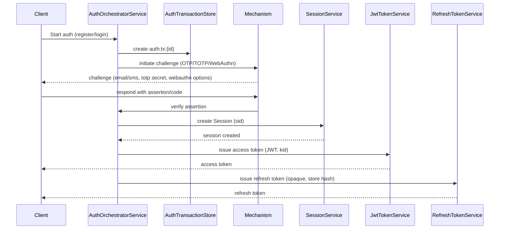
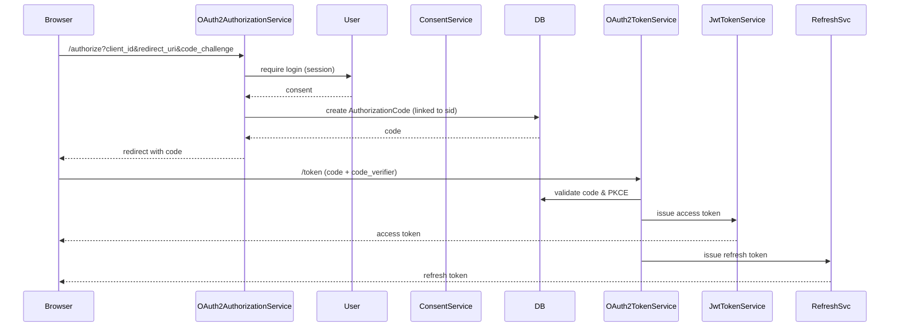
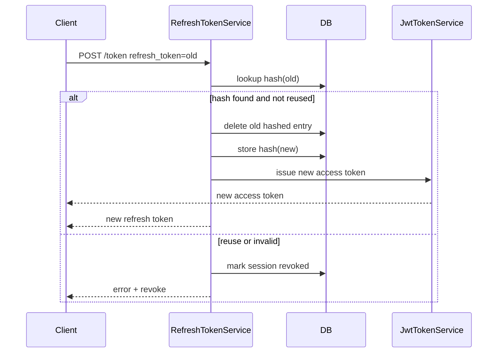

# Architecture Synthesis — Passwordless IdP

This document condenses the repository's architecture and key authentication flows to resume work without re-reading all files.

## High-level Overview
- Java 17 + Spring Boot monolith implementing a passwordless IdP supporting OTP, TOTP, WebAuthn, and OAuth2/OIDC.
- Persistence: JPA (MySQL) for long-lived entities (users, sessions, clients, signing keys, tokens).
- Ephemeral state: Redis for ceremonies, auth transactions, rate-limits, and session caching.
- JWT: Nimbus JOSE + JWT; RSA signing keys persisted in `SigningKey` entity and exposed via JWKS endpoint.
- Frontend: TypeScript SDK and helpers under `src/main/frontend` (webauthn.ts for client flows).
- Dev: Docker Compose orchestrates MySQL, Redis, Mailhog, Nginx reverse proxy.

## Core Components
- Auth orchestration: `AuthOrchestratorService` coordinates register/login/verify and delegates to OTP/TOTP/WebAuthn services.
- Transaction store: `AuthTransactionService` (Redis) holds transient state across multi-step auth flows.
- OTP subsystem: `OtpService` (senders: Email/Twilio/Dummy), `SentOtp` entity, rate limiting.
- TOTP subsystem: `TotpService`, `RegisteredTotp` entity, base32 secrets.
- WebAuthn subsystem: `WebAuthnRegistrationService`, `WebAuthnLoginService`, credential persistence and counter handling.
- OAuth2: `OAuth2AuthorizationService`, `OAuth2TokenService`, `ConsentService`, authorization code + PKCE flows implemented.
- Token management: `JwtTokenService` (issues JWTs), `RefreshTokenService` (opaque, hashed storage + rotation), `TokenBlacklistService`.
- Key management: `KeyManagementService` persists RSA keys, signs tokens with `kid`, and generates JWKS.
- Session management: `SessionService` persists sessions in DB and caches active state in Redis; sessions include `sid` used in tokens.

## Important Flows

- Passwordless Registration / Login (common pattern):
  1. Client requests start (register/login) -> `AuthOrchestratorService` creates an auth transaction (Redis).
  2. Choose mechanism: OTP/TOTP/WebAuthn.
  3. Challenge sent (OTP via `OtpService`, TOTP secret provided, WebAuthn challenge via ceremony in Redis).
  4. Client verifies challenge -> orchestrator verifies and creates a `Session`.
  5. `JwtTokenService` issues access token (JWT, signed with current `kid`) and `RefreshTokenService` issues opaque refresh token (stored hashed).

- OAuth2 Authorization Code + PKCE:
  1. `authorize` endpoint validates client and user session or prompts for login.
  2. On consent/approval, create `AuthorizationCode` linked to `sid` and client.
  3. Token endpoint exchanges code (and PKCE verifier) for access token (JWT) + refresh token; refresh tokens rotate on use.

- Refresh Token Rotation:
  - Refresh tokens are opaque random strings; server stores a SHA-256 hex hash of the token. On refresh, a new refresh token is issued and stored; the old hashed token is deleted/invalidated. If reuse detected, revoke session and tokens.

- JWT & Key Rotation:
  - Access tokens: JWTs signed with RSA private keys stored in DB (SigningKey records). Header contains `kid`.
  - JWKS endpoint exposes public keys derived from persisted keys.
  - Key rotation must preserve previous public keys until all issued tokens using older `kid` are expired or revoked.

- Session & Revocation:
  - `sid` claim present in tokens. Session revocation marks DB and Redis; Token revocation uses TokenBlacklist and/or deletes refresh token hashes.
  - Session cache in Redis speeds up lookup; ensure invalidations update both DB and cache.

## Redis Keys & Prefixes (critical)
- `auth:tx:{id}` — auth transactions (registration/login flows).
- `webauthn:ceremony:{id}` — WebAuthn challenges and state.
- `session:active:{sid}` — cached active session flags.
- `recovery:token:{id}` — recovery & backup tokens.

Changing prefixes or TTLs affects live ceremonies and sessions.

## Security & Operational Notes (Priorities)
- High: Do NOT change `KeyManagementService` `kid` semantics without a migration plan; altering key format or signing algorithm breaks JWT verification for clients and downstream services.
- High: Refresh token hashing & rotation logic must be preserved when changing storage schemas; include a migration to re-hash or backfill if necessary.
- Medium: JIT provisioning (creating `default.com` domain/user) is convenient for development but can lead to unexpected accounts in production — disable or gate behind a flag in prod.
- Medium: WebAuthn counter handling must correctly update the persisted counter to avoid invalidating authenticators; replay detection is enforced.
- Monitoring: Log key rotation events, refresh token reuse detections, and WebAuthn counter anomalies.

## Next Steps (recommended)
1. Finish synthesis by adding sequence diagrams (mermaid) for: auth transaction -> OTP/TOTP/WebAuthn, OAuth2 authorize/token, refresh rotation.
2. Draft production docs: key rotation runbook, secrets management (KMS/KeyVault), disable JIT provisioning, backup strategy for signing keys.
3. Run integration smoke tests in Docker Compose and validate JWKS + token issuance.

## Quick Links
- Application entry: `src/main/java/org/openidentityplatform/passwordless/PasswordlessApplication.java`
- Key services to inspect: `JwtTokenService`, `KeyManagementService`, `RefreshTokenService`, `AuthOrchestratorService`.
- Docker Compose: `docker-compose.yaml`

---

If you want, I can now:
- generate mermaid sequence diagrams and add them to this file, or
- draft the production runbook for key rotation and secrets, or
- start the app via Docker Compose and run a smoke test.

Tell me which of these to do next.

## Sequence Diagrams

### Passwordless (OTP/TOTP/WebAuthn) Flow

### OAuth2 Authorization Code + PKCE

### Refresh Token Rotation

---

If you'd like, I can also render these diagrams into separate `.mmd` files or embed PNG exports for documentation consumers.