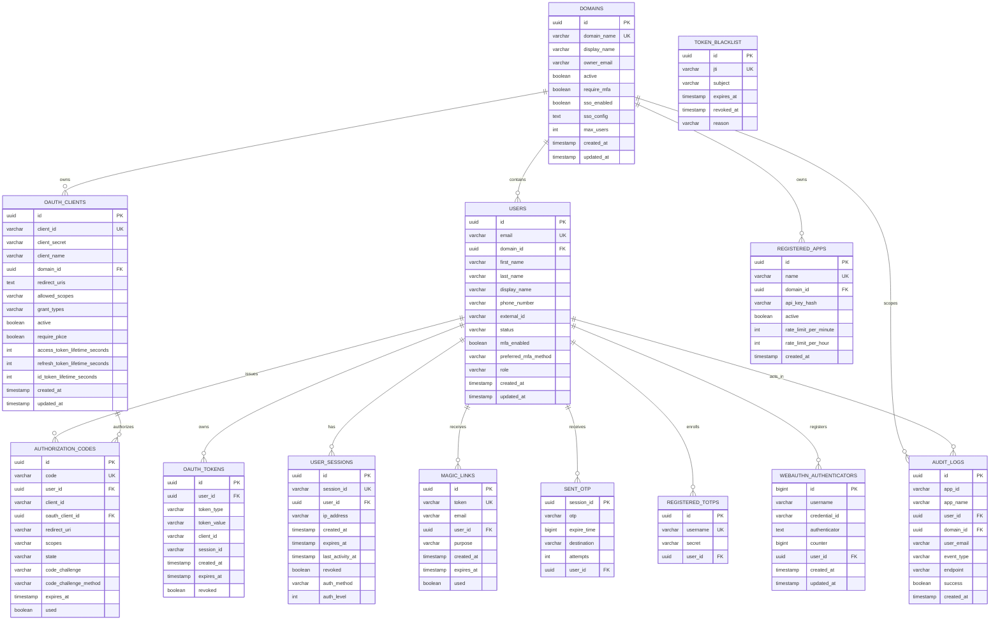

# Database Entity Relationship Diagram (ERD)

This document provides an up-to-date ER diagram of the current Passwordless IdP data model based on entity mappings under src/main/java.

## 1. Mermaid ER Diagram

## 2. Notes on Relationship Types

### 2.1 Physical FK relationships
The following relationships are modeled as JPA ManyToOne and materialized as FK columns:
- users.domain_id -> domains.id
- oauth_clients.domain_id -> domains.id
- authorization_codes.user_id -> users.id
- authorization_codes.oauth_client_id -> oauth_clients.id
- oauth_tokens.user_id -> users.id
- user_sessions.user_id -> users.id
- magic_links.user_id -> users.id
- sent_otp.user_id -> users.id
- registered_totps.user_id -> users.id
- webauthn_authenticators.user_id -> users.id
- registered_apps.domain_id -> domains.id
- audit_logs.user_id -> users.id
- audit_logs.domain_id -> domains.id

### 2.2 Logical (non-FK) references
The model also contains string-based references used by application logic:
- oauth_tokens.client_id -> oauth_clients.client_id (logical link)
- oauth_tokens.session_id -> user_sessions.session_id (logical link)
- authorization_codes.client_id -> oauth_clients.client_id (logical link)
- audit_logs.app_id/app_name -> registered_apps.id/name (logical link)

## 3. Scope of This Diagram

This ERD focuses on persistent relational entities currently mapped with JPA. Redis-based ephemeral state (for example WebAuthn ceremony state and active-session cache keys) is intentionally excluded because it is key-value state, not relational schema.
